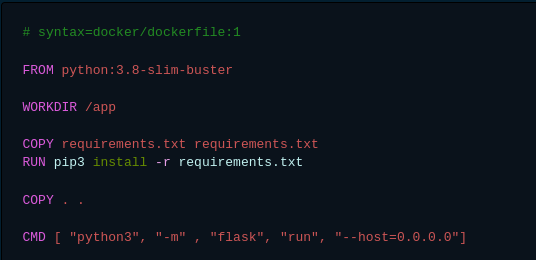
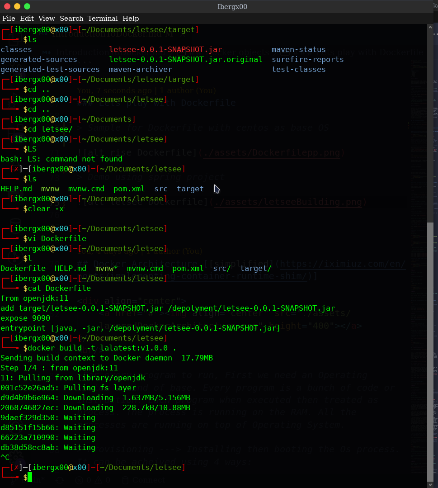
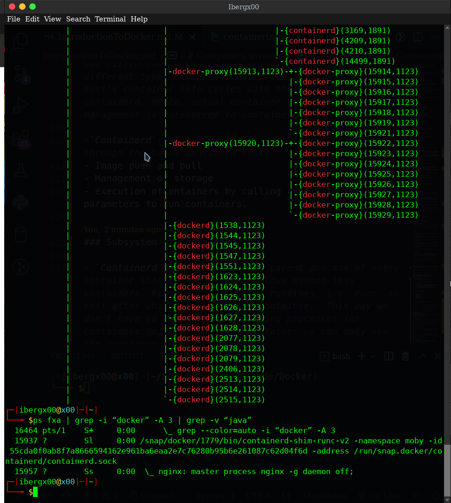
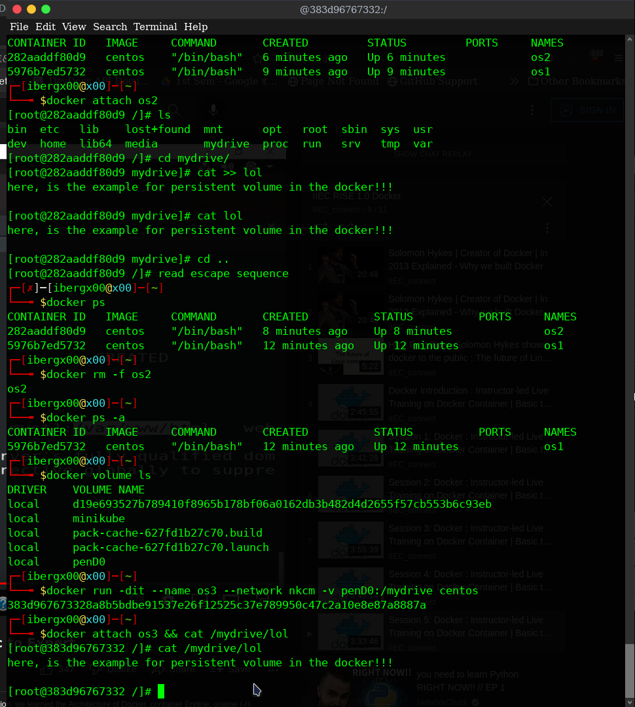
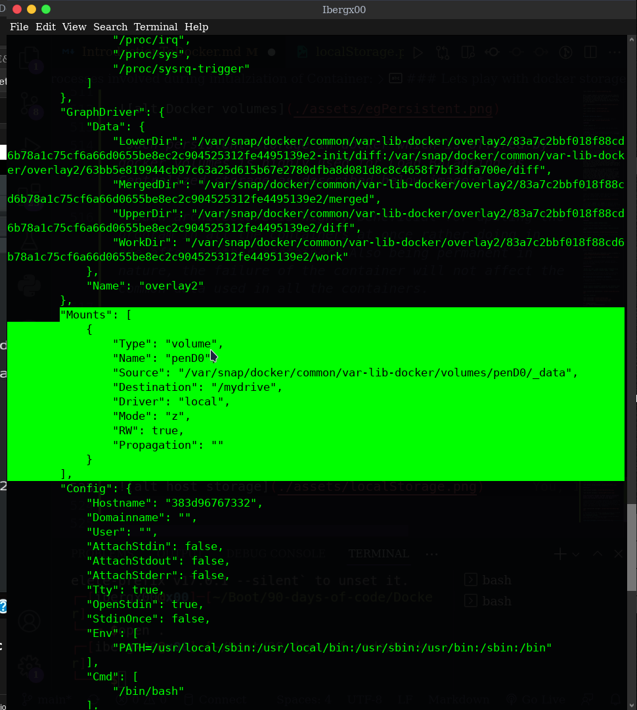

<div align="center">
    <a href="#"></a>
</div>
<br/>

```
Docker is a Containerization tool for developing, shippiing, and running applications. 
It enables separation of applications from infrastructure so that 
software can be quickly delivered and reduces the delay between writing code and running it in production.
```

<div align="center">
    <h1>Containerization</h1>
</div>

```
Containerization is the packaging together of software code with all it’s necessary components like libraries, frameworks, and other dependencies so that they are isolated in their own "container" aka isolated environment.
Containerization technology tools like Docker, Containerd, and so on.
Software containers are a form of OS virtualization where the running container includes just the minimum operating system resources, memory and services required to run an application or service.
```
<div align="center">
    <h1> Containerization Architecture</h1>
</div>

<div align="center">
    <a href="#"></a>
</div>
<br/>

## Docker objects
- Images
- Containers
- Volumes
- Network
- plugins 
and so on

*Docker Imgaes*

```
Images also can be called Classes, a kind of blueprint or templates for where creation of container happens.
Every images itself based upon another images. Like Every class inheritates Object class in JAVA
```

*Docker Image Creation*

- Using `docker commit <existing container> <Name for new image>`

> Here, docker basically clone the existing container and all the changes made to the container and then create a new image out of it. 


- Using custom Dockerfile

*COMMAND*

` docker build -t <custom image name> <location of the folder where the Dockerfile exist along with the project you want to containerize>`



*Docker Containers*

```
Containers are runnable instances of an image. By default, they are relatively well isolated from other containers and its docker host. 
Container is an isolated method of packaging application code, all its dependencies, libraries, frameworks into a single deployment unit.
we can control how isolated a container’s network, storage, or other underlying subsystems are from other containers or from the host machine.
Containers are defined bu its image as well as any configuration option we provide to it during the container creation or initiation.
```

### Lets play with Dockerfile

> Demo using spring project



## Docker Architecture [[simplified](https://iximiuz.com/en/posts/implementing-container-runtime-shim/)]

<div align="center">
    <a href="#"></a>
</div>
<br/>

>For every program to run, First we need an Operating system a kind of base. Every program is a bunch of code or instruction. Each program when executed then treated as process. The process is running on the RAM. All the processes are running on top of Operating System.

> Provisioning ---> Installing then booting the Os process. It can be acheived using 4 ways:

|Bare Metal |Cloud computing |Virtualization |Docker|
|:---:|:---:|:---:|:---:|
|||||
|Operating System |Instances |Virtual Machine| Container|


<br>

**Lets Make hand dirty with docker**

*staring the docker engine on top of OS*

```
systemctl enable docker -> enabling the docker service
systemctl start docker -> to start docker engine
```

> if you are using snap 

```
sudo snap start docker
```

> Checking stats of docker engine

```
systemctl status docker.service
systemctl status snap.docker.dockerd.service
```

<div align="center">
    <a href="#"></a>
</div>

<br/>

## Lets play with docker CLI and launching the containers

*when we execute `docker run <images>`*

```
Docker configure, install , boot and login the Operating System within a second.
```

*Trick*

> Ctrl + p + q ------> Get out of the container without closing it.


> Also we can execute the particular process and exit the container but don't delete the container.

*COMMAND* 

`docker run <image id> <command>`  

> container run in background and execute the command with no terminal and no interactive medium and exits immediately.
> used with non interactive commands like date, ping

`docker run -it <image>`

> container run with provided terminal to interact with the contianer

`docker run -dit <image>`

> container run in detached mode or in background with out giving a interactive terminal at initial.


`docker run --rm ubuntu <command>`

 --> enter the os execute the command and exit the container also delete the container 


> Removing the images and containers


<br>

## Lets play with information 

*COMMAND*

`docker info`

<div align="center">
    <a href="#"></a>
</div>

<br/>

<div align="center">
    <a href="#"></a>
</div>
<br/>

- `docker contianer inspect --format "" <container name>` 

--> act like print statement

- `docker contianer inspect --format "{{ <path to variable to access }}" <container name>`


## Sharing the images [Export and Import]

- Docker registry

**Workflow**

<!--  -->
<div align="center">
    <a href="#"></a>
</div>

<br>

*COMMAND*

`docker push <image name>`

*syntax*

`docker_user_id/image_name`

then, 

`docker pull <image name>`

<br>

- Docker `save` and `load`

**Workflow**

<div align="center">
    <a href="#"></a>
</div>

*COMMAND*

`docker save <docker image> -o <custom name for your file>` 

then, transfer the file to another system.

`docker load -i <path to that file> `

<br>

## Lets play with some details behind docker containers

<br>

> we can monitor the running container using some commands

*COMMAND*

`docker logs <container id>`


> For live monitoring we can use fetch (-f) as flag

*COMMAND*

`docker logs -f <container id>`


## lets connect with the running container

*COMMAND*

`docker attach <container id>`
> It let inside the container 
> It increase the human intervention so not prefer this command
> With Ctrl + d --> stops the running container

or,

`docker exec -it <container id> <command>`
> It basically execute the command inside the selected container and return back.
> Help in automating and scripting

`docker exec -it <container id> bash`
> With Ctrl + d --> exits the bash, don't stop the running contianer


<br>

<div align="center">
    <h1>Networking Stuff</h1>
</div>

> Before jumping into Docker network architecture.

### <u>*Default Gateway*</u>


```
Think of a default gateway as an intermediate device between the local network and the internet. The default gateway transfers internal data to the internet and back again.
In most homes and small offices, the default gateway is a router that directs traffic from the local network to the cable or DSL modem, which sends it to the internet service provider (ISP).
```


### <u>*Subnet Mask*</U>


```
When a bigger network is divided into smaller networks, to maintain security, then that is known as Subnetting.
Each network is considered as subnets.
A subnet mask reveals how many bits in the IP address are used for the network by masking the network portion of the IP address.
```


<br>

## Docker Networking begins!!

> Virtual Lab using Containers and docker network.


*COMMAND*

`docker network ls`

> preconfigured drivers and detail can be show using following command.

> *bridge* is the default network so whenever we launch the containers all the container reside in the *bridge* network *by default*.

`docker config`

`docker network inspect <network driver>`


>Docker networking is a passage of communication among all the isolated containers. There are mainly five network drivers in docker:

- Bridge: It is the default network for containers that are not able to communicate with the outside world. You use this network when your application is running on standalone containers, i.e., multiple containers in a network that only lets them communicate with each other and not the outside world.

- Host: This driver allows for seamless integration of Docker with your resources running on your local machine. It relies on the native network capabilities of your machine to provide low-level IP tunneling and data link layer encryption between the Docker apps running on different endpoints.

- Overlay network: This is a type of software-defined networking technology that allows containers to communicate with other containers. To connect it to an external host, first, you must create a virtual bridge on one host and then create an overlay network. You’ll also need to configure the overlay network and grant access from one side to the other. A “none” type driver usually means that the networking is disconnected.

- macvlan: In order to assign an address for containers and make them similar to that of physical devices, you can use the macvlan driver. What makes this unique is that it routes traffic between containers through their associated MAC addresses rather than IPs. Use this network when you want the containers to look like physical devices, for example during migration of a VM setup.


> Here, IP Adress Manager (IPAM) basically a Database that store network names, driver detail, ip addresses, and so on. Inside this, we have DHCP, DNS ..


> As we know `switch` and `router`are physical device but we can recreatet these device in software form using some software or tools then they are considered as bridge.
> So Bridge a kind of working as switch and also router in the network.

<br>

<div align="center">
    <h1>Creating own network</h1>
</div>

*COMMAND*

`docker network create <network name>`

> along with selection of available driver

`docker network create <network name> --driver=<driver name>`


> We specify inwhich network to launch our containers

*COMMAND*

`docker run -dit --name <custom name> --network <network name>  <image>`


> if the multiple containers in custom network, DNS resovling aka linking  is provided whereas not in default network.
 
 

 

> we can launch container in None network for max. security and some testing stuff. The None network is absolutly isolated.

*RECOMMANDED*

`docker run -dit --name <custom name> --network-alias <custom name> --network <network name>  <image>`

> Alias are given to container for easy classificatio and identifying of which network group they belong
 
### Connection with Contianers and Networks.

> Disconneting the container from network and connecting to another network.

> Highly used while testing.

`docker network disconnect <container id> <network name>`
`docker network connect <container id> <network name>`


`for [os] container`


<div align="center">
    <h1> Docker Architecture</h1>
</div>

## High-Level overview of initializing container

<div align="center">
    <a href="https://blog.opstree.com/2020/01/21/docker-inside-out-a-journey-to-the-running-container/"></a>
</div>
<br/>

## Componets invovled
```

    1.Docker-cli
    2.Dockerd
    3.Containerd
    4.RunC
    5.Containerd-shim

```

> `Docker-cli`: Used to make Docker API calls basically act as an agent with docker daemon and clients.

> `Dockerd`: Listens for Docker API requests, dockerd can listen for Docker Engine API requests via three different types of Socket: unix, tcp, and fd and manages host’s container life-cycles with the help of containerd. Hence, actual container life-cycle management is outsourced to containerd. 

>`Containerd`: Actually manages container life-cycle through the below-mentioned tasks:
- Image push and pull
- Management of storage
- execution ofcontainers by calling runc with the right parameters to run containers.

### Subsystem of Containerd

> `Containerd shim`: Shim is the parent process of every container started and it also allows daemon-less containers. First, it allows the runtimes, i.e. runc, to exit after which it starts the container.  This way we don’t have to have the long-running processes for containers.So, when we start container we can only see the container running and shim.

`Daemon-less container`

> When containerd shim was not there, upgrading docker daemon without restarting all your containers was a big pain. Hence, containerd shim got introduced to solve this problem.

> `Runc`: A command-line tool for spawning and running the container according to OCI runtine specifications. After the container is successfully started, runc exits immediately.

## Docker internal Architecture

<br>

<div align="center">
    <a href="#"></a>
</div>
<br/>

## Processes involved during initialziation of Container:

<br>

> To view the processes.

*COMMAND*

`pstree -pg | grep -e docker -e containerd`

`ps fxa | grep -i “docker” -A 3 | grep -v “java”`  





<div>
    <h1>Docker Storage</h1>
</div>

```
By default, all files created inside a container are stored on a writable container layer.
The data don't persist when the container no longer exists.
Container's writeable layer is tightly coupled to the host machine where container is running lead in diffulty for data transpotation.
Writing into container's writable layer requires a storage driver to manage file system.
```

*Types of Storage*

> `Ephemeral storage` the volatile temporary storage attached to your instances which is only present during the running lifetime of the instance. Basically, Temporary in nature. Like C: drive, browser storing your password.

> `Persistent storage` is any data storage device that retains data after power to that device is shut off. Permanent in nature like  D: drive, cloud storage, pen drive.

*Type of Docker Storage*


> Where `Volumes` and `Blind Mount` are permanent in nature while `tmpfs` uses the host memory.

> Volumes have a dedicated filesystem on the host (/var/lib/ docker/volumes) and are directly controlled through the Docker CLI. On the other hand, bind mounts use any available host filesystem.


### Lets play with docker storage.

>What we are trying to acheive:


*Practical*




*such persistent storage in docker which is offered by docker volumes is highly used for Load Balancing as Centralized storage as described below image:*

> Such architecture is highly beneficial for upating the program in all the containers at once rather doing in one after another containers.Also being permanent in nature, the failure of the container will not affect the common data used in all the containers.


> The storage for the docker volume is actually occupied in the Host system ie, `/var/snap/docker/common/var-lib-docker/volumes/` as `source` and `/mydrive` as `destination`
> All the volumes created are present inside the above mentionedfolder along with the data.

>`/var/snap/docker/common/var-lib-docker/volumes/penD0/_data` as `source` and `/mydrive` as `destination`




> Let's do it with custom source and destination.

> Acessing and using the software, files inside the container from Host machine.

