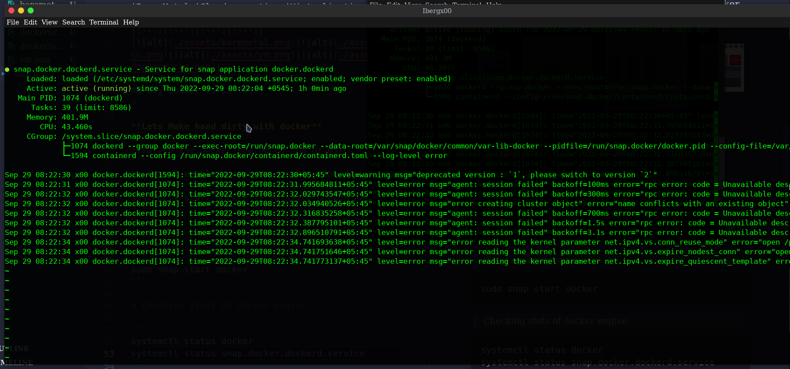

<!-- <div align="center">
    <a href="#"></a>
    <br/>
</div> -->

<div align="center">
    <a href="#"></a>
</div>
<br/>

<h1 style="border:0;font-weight:bold" align="center">Docker</h1>

```
Docker is a Containerization tool for developing, shippiing, and running applications. It enables separation of applications from infrastructure so that software can be quickly delivered and reduces the delay between writing code and running it in production.
```

## Containerization 

```
Containerization basically process for creating an isolated environment in form of containers. Containerization technology tools like Docker, Containerd, and so on.
Software containers are a form of OS virtualization where the running container includes just the minimum operating system resources, memory and services required to run an application or service.
```


## Docker Architecture [[simplified](https://iximiuz.com/en/posts/implementing-container-runtime-shim/)]

<div align="center">
    <a href="#"></a>
</div>
<br/>

>For every program to run, First we need an Operating system a kind of base. Every program is a bunch of code or instruction. Each program when executed then treated as process. The process is running on the RAM. All the processes are running on top of Operating System.

> Provisioning ---> Installing then booting the Os process. It can be acheived using 4 ways:

|Bare Metal |Cloud computing |Virtualization |Docker|
|:---:|:---:|:---:|:---:|
|||||

## Why Docker is so fast? 
>

**Lets Make hand dirty with docker**

*staring the docker engine on top of OS*
```
systemctl enable docker -> enabling the docker service
systemctl start docker -> to start docker engine
```

> if you are using snap 

```
sudo snap start docker
```

> Checking stats of docker engine

```
systemctl status docker.service
systemctl status snap.docker.dockerd.service
```
<div align="center">
    <a href="#"></a>
</div>
<br/>

## Lets play with docker CLI
