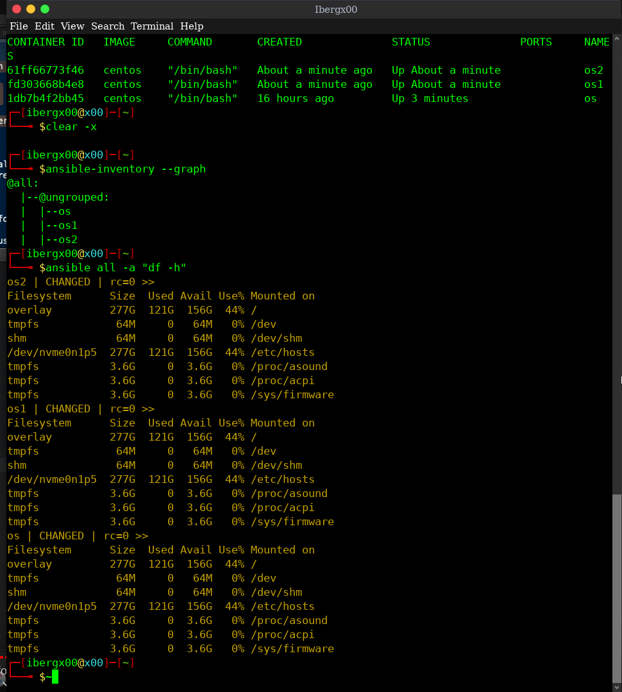
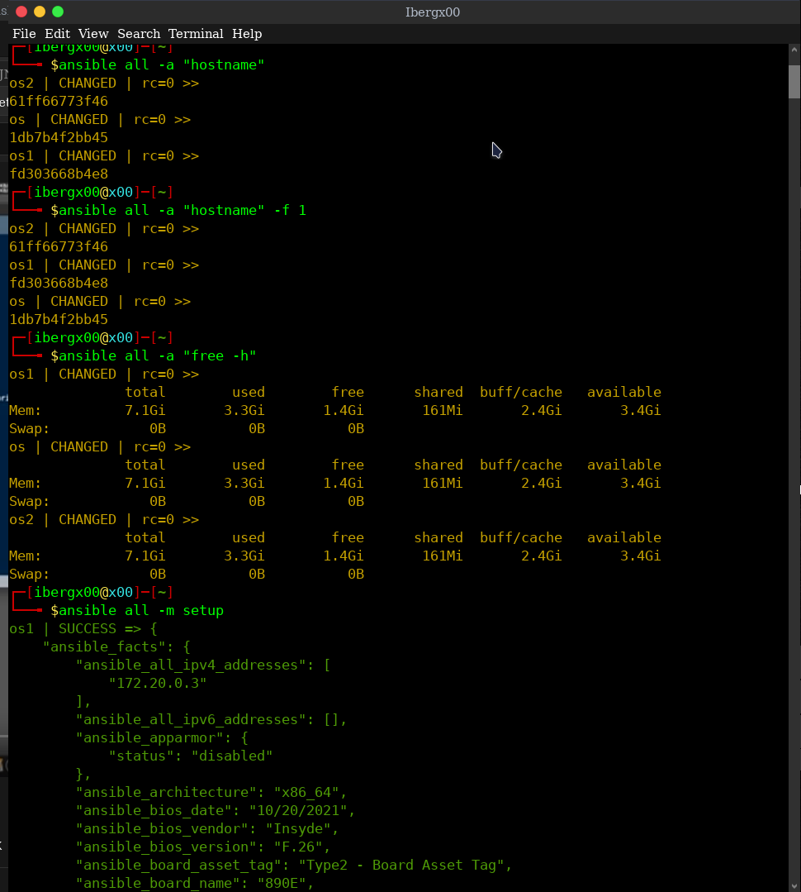

<div align="center">
    <h1>Ansible</h1>
</div>
<br>

```
Ansible is an open-source configuration management tool owned by RedHat, IT automation engine that automates cloud provisioning, intra-service orchestration, configuration management, application deployment, and many other IT needs.
```
[blog](https://www.interviewbit.com/blog/ansible-architecture/)
[blog1](https://medium.com/@madhukaudantha/ansible-and-ansible-architecture-2f309fe53fa)

*Why Ansible*

- *Free*: Ansible is an open-source tool.
- *Powerful*: Ansible lets you model even highly complex IT workflows.
- *Flexible*: You can orchestrate the entire application environment no matter where it’s deployed.`configuratio/installation/deployment` steps are coded in single yaml file. Further, re-use same file multiple times even in different evn.
- *Agentless*: You don’t need to install any other software or firewall ports on the client systems you want to automate, basically using `ssh` for access to servers. You also don’t have to set up a separate management structure.
- *Efficient*: Because you don’t need to install any extra software, there’s more room for application resources on your server.

*where Anisble*


<div align="center">
    <h1>Ansible Architecture</h1>
</div>
<br>

 


> Let's talk about Modules

```

Basically, modules are small programs that carry out the actual work.Each module has one specific task; install the server, start the server, clean up, copy file and so for each task there are indivisual modules for each task.

```


> Let's talk about Playbook

> Tasks

```
Since, Modules are granular and specific for complex infrastructure and application, we nedd many modules in cetain sequence, grouped together. Here, comes the Playbook.
```

> First, the sequencnal modules are grouped in `tasks:` as shown


> Further we need which server and who is performing this, for that we specify `hosts:` and `remote_user:`

>Furthermore, we can specify a custom variables in playbook as shown 


> `Play` `Book`


> Playbook


>Moreover, specifying the name of the playbook what actually the playbook gonna do is good practice.

> Inventory

*List of machine that are going to be involved in task execution*


> we can use server url instead for thier IPs using `name` just like declaring custom variables.

***
***

<div align="center">
    <h1>Lets your hands be Dirty!!</h1>
</div>
<br>

> Running docker container using ansible


> Docker ps


> Playbook


***

> Here,In this demo, i am using docker container as my servers. I cannot afford the AWS EC2 server cause `i am poor` 
[set up docker container as hosts](https://techq.medium.com/how-to-setup-ansible-dynamic-inventory-for-docker-using-ansible-plugin-ec308e677cd6)
 
*Let's connect our poor server using ssh*

```
sudo apt-get install ssh
sudo systemctl ssh start
sudo systemctl ssh enable
service ssh status
```


> openssh-server is not installed on the `os` container so we couldnot get access using ssh


*Ansible knows all the server that are listed in anisble-inventory so we can,*

*COMMAND*

> `ansible -i inventory <host-names> -m ping -u root`

*for my setup i can do like this*

> `ansible <container-name> -m ping`


*Flags*

> *-i* -> inventory
> *-m* -> module
> *-a* -> argument for module
> *-b* -> become [different users that mean default as root]

*if we dont provide module while using only argument then the ansible apply the -m `command`*

> Playing with ad-hoc commands

```
An Ansible ad hoc command uses the /usr/bin/ansible command-line tool to automate a single task on one or more managed nodes. ad hoc commands are quick and easy, but they are not reusable.
ad hoc commands are great for tasks you repeat rarely. For example, if you want to power off all the machines in your lab for Christmas vacation, you could execute a quick one-liner in Ansible without writing a playbook.
These `ad-hoc commands`  are not used for configuration management and deployment, because these commands are of one time usage.
`ansible-playbook` is used for configuration management and deployment.
```

> ansible [pattern] -m [module] -a "[module options]"



> `setup` module provide all the information about the server that ansible can figure out. It also help figuring out the some keys and arguments for the playbook while creating own playbook.



> `gather_facts` module provides the facts about the servers


> `ansible -i inventory -b -m yum -a "name=ntp state=present"`

> to install the ntp package and to check the availaibility of the packages in those servers.


> `ansible -i inventory -b --ask-become-pass yum -a "name=ntp state=present"` 

*or,*

> `ansible -i inventory -b -K yum -a "name=ntp state=present"` for sudo user that requires password

> `ansible-doc <module name>` provides docs for the provided module.

***

<div align="center">
    <h1>Lets paly with playbook</h1>
</div>
<br>