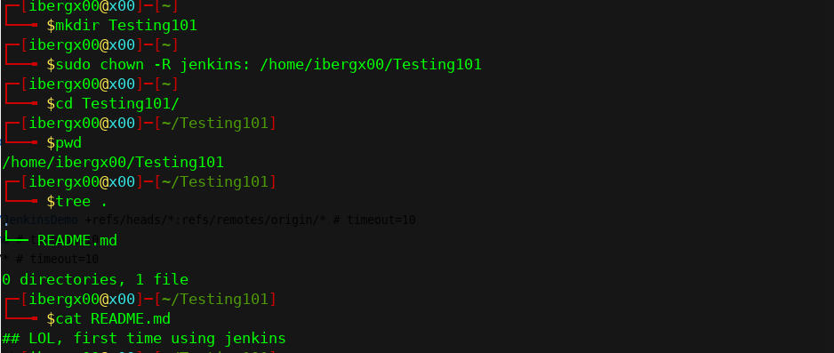
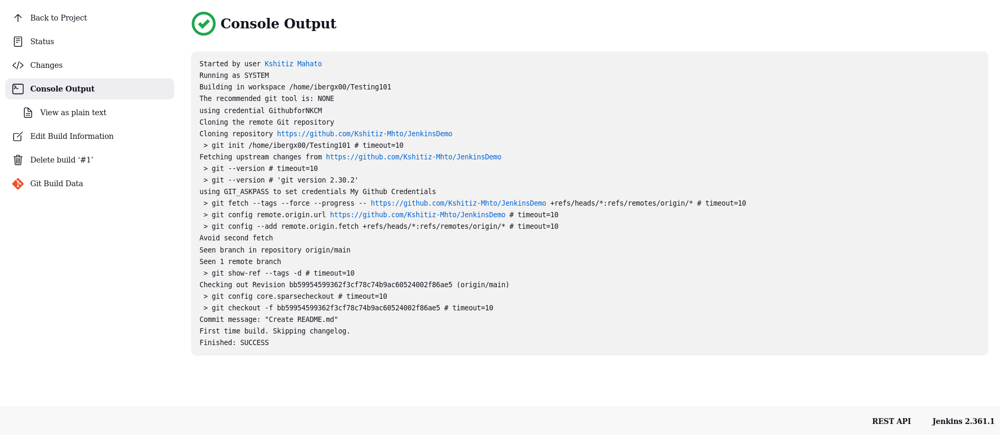
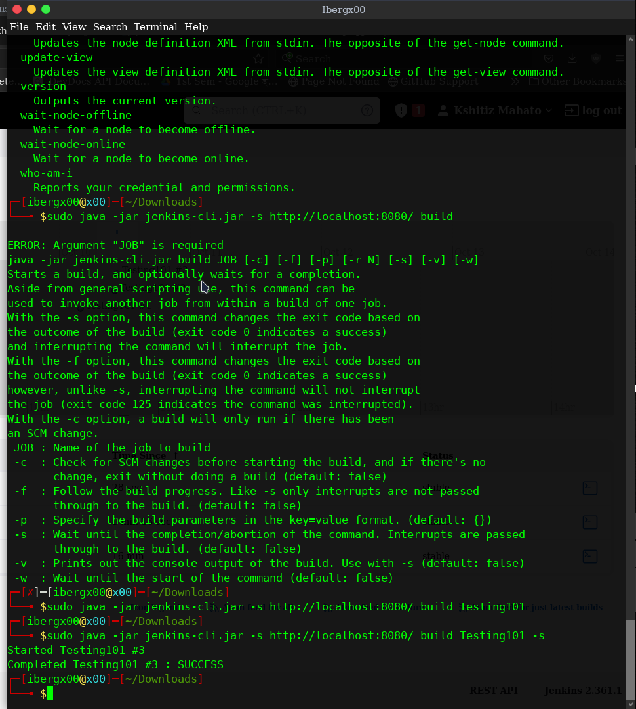
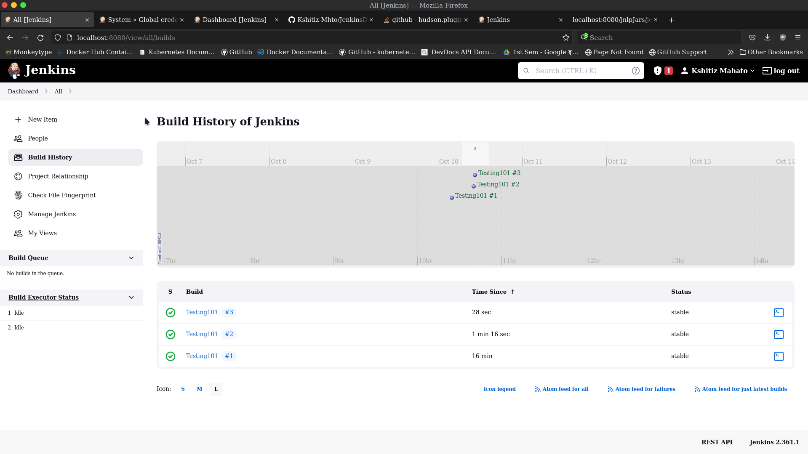
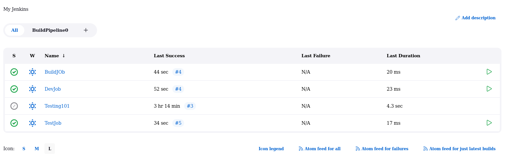
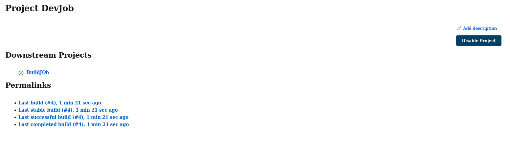
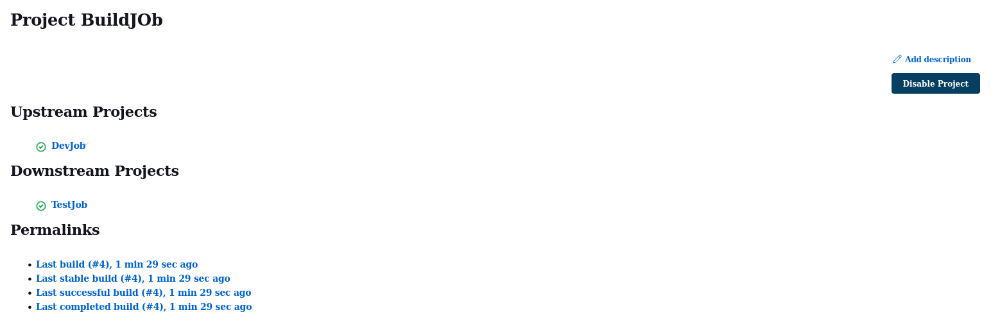
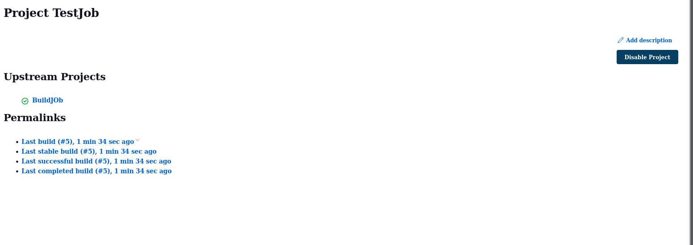
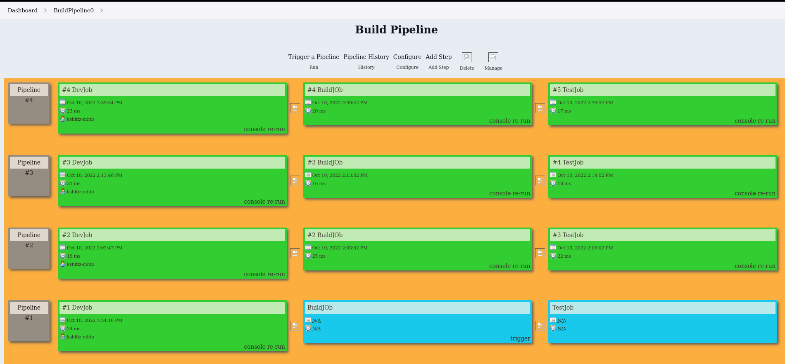

## LOL, first time using jenkins

[Git repo Link onwhich worked on](https://github.com/Kshitiz-Mhto/JenkinsDemo)

> Further

> Chain jobs and Pipelines

*Concept of Upstream and Downstream project should be known*

