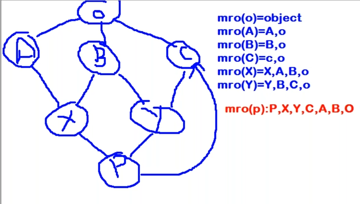

# Inheritance

>Inheritance is the capability of one class to derive or inherit the properties from another class. 

## Benefits of inheritance are: 

- It represents real-world relationships well.
- It provides the reusability of a code. We don’t have - to write the same code again and again. Also, it allows us to add more features to a class without modifying it.
- It is transitive in nature, which means that if class B inherits from another class A, then all the subclasses of B would automatically inherit from class A.

*Python Inheritance Syntax*

```
Class BaseClass:
    {Body}
Class DerivedClass(BaseClass):
    {Body}
```

[Types of Inheritances](https://www.geeksforgeeks.org/types-of-inheritance-python/?ref=lbp)

*Cyclic Inheritance* is not supported in python!!


## Method Resolution Order (MRO)

>Method Resolution Order(MRO) it denotes the way a programming language resolves a method or attribute. Python supports classes inheriting from other classes. The class being inherited is called the Parent or Superclass, while the class that inherits is called the Child or Subclass. In python, method resolution order defines the order in which the base classes are searched when executing a method. First, the method or attribute is searched within a class and then it follows the order we specified while inheriting. This order is also called Linearization of a class and set of rules are called MRO(Method Resolution Order). While inheriting from another class, the interpreter needs a way to resolve the methods that are being called via an instance.

## C3 Algorithm
 
>C3 Linearization algorithm is an algorithm that uses new-style classes. It is used to remove an inconsistency created by DLR Algorithm. It has certain limitation they are: 
 
- Children precede their parents
- If a class inherits from multiple classes, they are kept in the order specified in the tuple of the base class.

> C3 Linearization Algorithm works on three rules: 
 
- Inheritance graph determines the structure of method resolution order.
- User have to visit the super class only after the method of the local classes are visited.
- Monotonicity



>mro(p) = p + merge(mro(x),mro(y),mro(c),xyc)
>       = p + merge(xabo,ybco,co,xyc)
>       = p + x +  merge(abo,ybco,co,yc)
>       = p + c + a + merge(bo,ybco,co,yc)
>       = p + c + a + y + merge(bo,bco,co,c)
>       = p + c + a + y + b + merge(o,co,co,c)
>       = p + c + a + y + b + c + merge(o,o,o)
>       = p + c + a + y + b + c + o

```
[<class '__main__.P'>, <class '__main__.X'>, <class '__main__.A'>, <class '__main__.Y'>, <class '__main__.B'>, <class '__main__.C'>, <class 'object'>]
```

>if head element of first list no present in tail part of any other list, consider that element in the result and remove that element from all the lists.

ABCDEF
head element : A
tail element : BCDEF