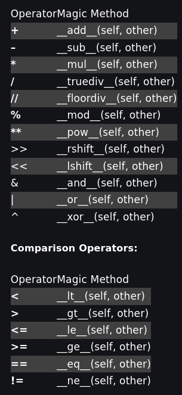
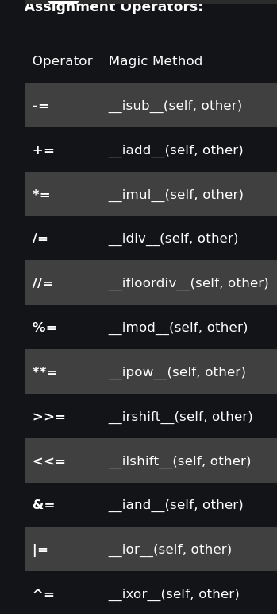
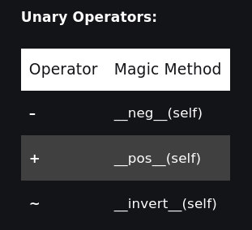
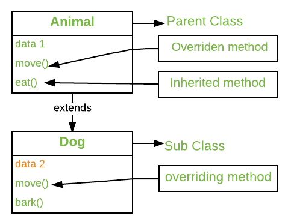

# Polymorphism

>The word polymorphism means having many forms. 
>In programming, polymorphism means the same function name (but different signatures) being used for different types.

## <u>Types</u>

- Static Polymorphism [overloading]

>python provide only Operator Overloading not Method and Constructor Overloading

## Magic methods 

- Dynamic Polymorphism [overriding]

>python provide Method and Constructor overriding 

    