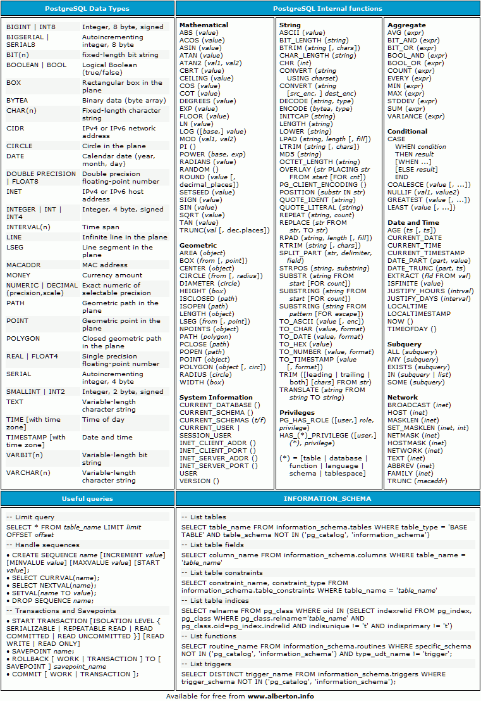
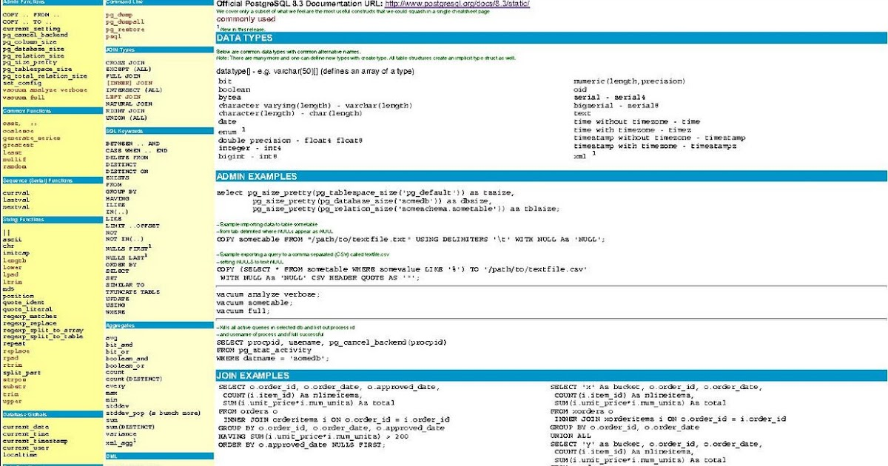

# Postgres AKA PostgreSQL

### PostgreSQL is an object-relational database management system (ORDBMS) based on POSTGRES, Ver-sion 4.21, developed at the University of California at Berkeley Computer Science Department. POST-GRES pioneered many concepts that only became available in some commercial database systems
### PostgreSQL is an open-source descendant of this original Berkeley code. It supports a large part of the
* ### SQL standard and offers many modern features:
- complex queries
- foreign keys
- triggers
- updatable views
- transactional integrity
- multiversion concurrency control
* ### Also, PostgreSQL can be extended by the user in many ways, for example by adding new
- data types
- functions
- operators
- aggregate functions
- index methods
- procedural languages
***

